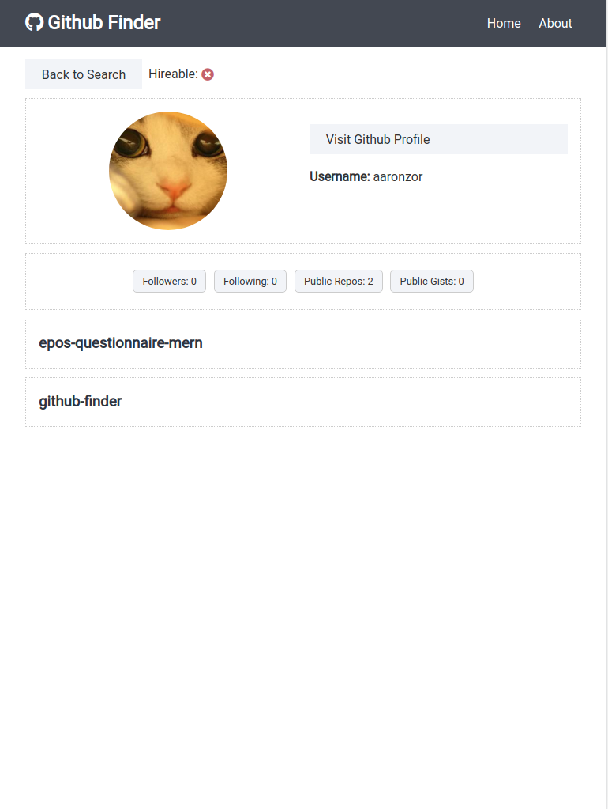

<h1 align="center">
  Github Finder
</h1>

<h2 align="center">
  Introduction
</h2>

This is a simple React application that makes use of the github api. Users can search for any github user and see information such as repositries.

The app is lightweight and fast, with a simple user interface.

<h2 align="center">
  <a href="https://gh-search-react.netlify.app/">Click here for a Live Demo</a>
</h2>
 
<h2 align="center">
Tech Stack
</h2>

-   React (Router, Context-API, Hooks), CSS
-   Github API
-   Deployment: Netlify live demo

  
  
  
  

<h2 align="center">
 Screenshots
</h2>

  
  

